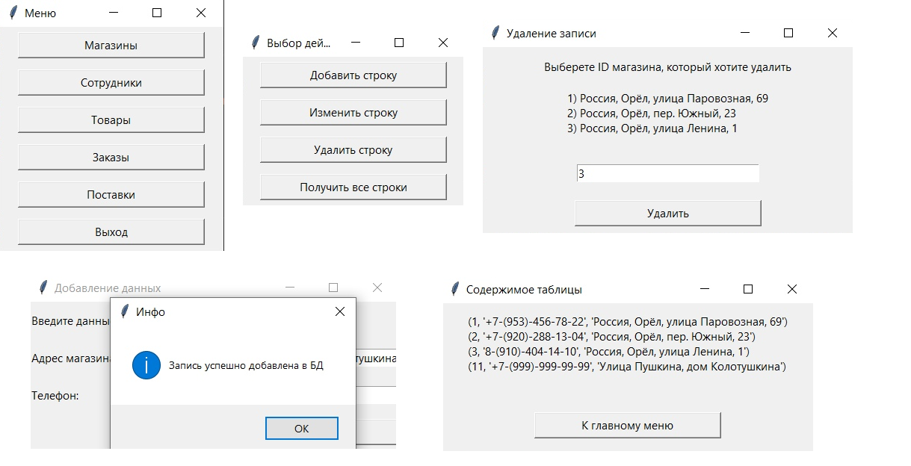
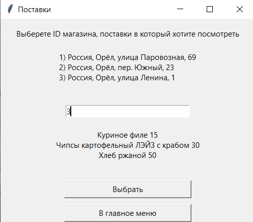

# Консольное приложение для взаимодействия с базой данных сети продуктовых магазинов

Приложение осуществляет подключение к базе данных MySQL и предоставляет пользователю
различное взаимодействие с таблицами данной БД (добавление, изменение, удаление, получение данных; 
предусмотрены возможности получения особых данных, например, среднего чека по магазину в опр. время и т.п.)

# Диаграмма IDEF1X базы данных, используемой в программе

# Скриншоты работы программы

Пример работы с таблицей Shop

Вывод информации о сотрудниках опр. магазина

Вывод рейтинга популярности товаров

Вывод информации о среднем чеке магазинов в опр. время

Вывод информации о кол-ве доставленных товаров в опр. магазин

___